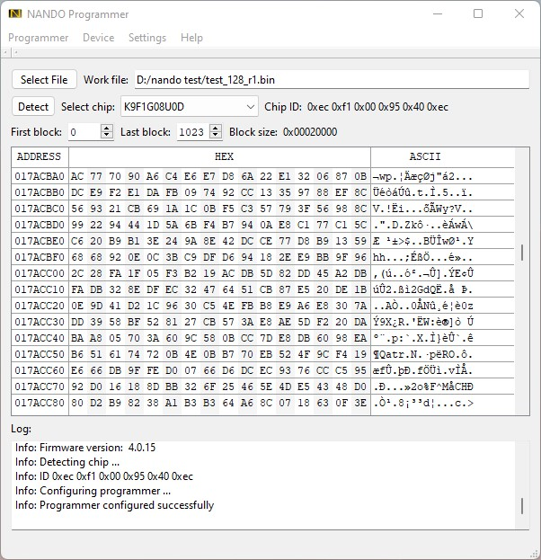

# NANDO (NANDopen) programmer

## General
NANDO is open source NAND programmer based on low cost MCU CH32V307VCT6. It supports parallel NAND, SPI NOR, SPI NAND programming.
High programming speed! For examle EM73C044SNB (1Gb) Write 110(s), Read 80(s).

PCB boards:

Application:

## Features
- USB_HS interface
- PC client software for Linux & Windows.
- TSOP-48 socket for NAND chip
- 8 bit parallel NAND interface
- SPI interface
- 3.3V NAND power supply
- NAND read,write and erase support
- NAND read of chip ID support
- NAND read of bad blocks
- NAND bad block skip option
- NAND include spare area option
- Configurable erase, write, read areas.
- Open KiCad PCB & Schematic
- Open source code
- Read & Write LEDs indication
- Extendable chip database
- Chip autodetection
- Firmware update

### Supported chips
#### Parallel NAND:
K9F2G08U0C, HY27US08121B, TC58NVG2S3E, F59L2G81A, MX30LF2G18AC and others.

See full list of supported chips [qt/nando_parallel_chip_db.csv](qt/nando_parallel_chip_db.csv)

#### SPI NOR flash
AT45DB021D, MX25L8006E, W25Q16JV and others.

See full list of supported chips [qt/nando_spi_nor_db.csv](qt/nando_spi_nor_db.csv)

#### SPI NAND flash
GD5F1GQ4UBxIG, MT29F2G01, F50L2G41LB and others.

See full list of supported chips [qt/nando_spi_nand_db.csv](qt/nando_spi_nand_db.csv)

## Release binaries
...

### License
In general the sorce code, PCB and schematic are under GPLv3 license but with limitations of:

## WiKi
Check [WiKi](https://github.com/bbogush/nand_programmer/wiki) page for more information.
